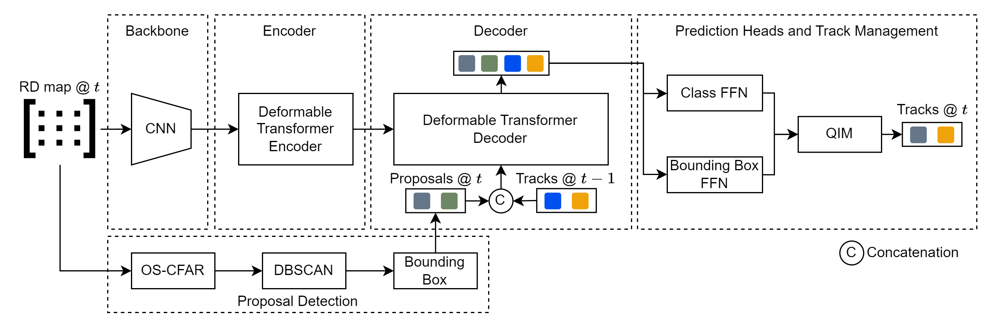

# RadarMOTR: Multi-Object-Tracking with Transformer Neuronal Networks in Range-Doppler Maps


**RadarMOTR** is a transformer neuronal network based on [MOTRv2](https://github.com/megvii-research/MOTRv2) able to track multiple objects in Range-Doppler maps. Objects are first detected by an external detector based on CFAR & DBSCAN clustering. Detected objects are then passed to RadarMOTR for association, i.e. tracking. Todays Radar trackers are built with handcrafted methods like Kalman Filter to perform association across frames. The parameters of such methods are difficult to configure and optimize. RadarMOTR solves this problems by associating objects using an neuronal network instead of a Kalman Filter.

<div align="center">



</div>

## Installation

The codebase is built on top of 
- [MOTRv2](https://github.com/megvii-research/MOTRv2)
- [MOTR](https://github.com/megvii-research/MOTR)
- [Deformable DETR](https://github.com/fundamentalvision/Deformable-DETR)
- [DETR](https://github.com/facebookresearch/detr)

### Requirements

* Linux (Tested on WSL Ubuntu 20.04.5 LTS)
* At least one CUDA capable GPU
* GNU G++ Compiler <11 (Tested with version 9.4.0)
* [Anaconda](https://www.anaconda.com/) or [Miniconda](https://docs.conda.io/en/latest/miniconda.html)

1. Clone repository with submodules
    ```sh
    git clone --recurse-submodules https://github.com/madeit07/RadarMOTR.git
    cd RadarMOTR
    ```

2. Install PyTorch using Conda
    ```sh
    conda create -n radarmotr python=3.11
    conda activate radarmotr
    conda install pytorch=2.1 torchvision=0.16 pytorch-cuda=11.8 -c pytorch -c nvidia
    ```

3. Install CUDA Toolkit 11.8 for compiling `MultiScaleDeformableAttention` (optional if already installed on system)
    ```sh
    conda install cuda-libraries-dev cuda-nvcc cuda-nvtx cuda-cupti -c nvidia/label/cuda-11.8.0
    ```

4. Install other requirements
    ```sh
    pip install -r requirements.txt
    ```

5. Build `MultiScaleDeformableAttention`
    ```sh
    cd ./models/ops
    ./make.sh
    ```

### Prepare dataset

Download the **RDTrack** dataset from [Google Drive](https://drive.google.com/drive/folders/1h0Tv5X86o7G_yNxn9_nTYm_3EKvdRcIO), unzip it and save it into `data/dataset/RDTrack`.

All paths are only recommendations. If you choose a custom path, make sure to update the dataset config (`configs/base/dataset.yaml`)

### Prepare pretrained weights

All weights are stored in [Google Drive](https://drive.google.com/drive/folders/1h0Tv5X86o7G_yNxn9_nTYm_3EKvdRcIO)

- If you train with **ResNet18** backbone, download `motrv2_base_r18_v2.pth` and save it in `data/models/`.
- If you train with **ResNet50** backbone, download `motrv2_base_v2.pth` and save it in `data/models/`.
- If you want to evaluate our model, download `radarmotr_r18.pth` and save it in `data/models/`.
  
All paths are only recommendations. If you choose a custom path, make sure to update pretrained path or model path in the configs (`configs/resnet50.yaml`, `configs/resnet18.yaml`, `configs/trackers/radarmotr.yaml`) or as command line arguments:
```sh
# ResNet18
python main.py with resnet18 pretrained=<MY_PATH_TO_MODELS>/motrv2_base_r18_v2.pth
# ResNet50
python main.py with resnet50 pretrained=<MY_PATH_TO_MODELS>/motrv2_base_v2.pth

# Eval
python main.py eval.py with radarmotr resnet18 model_path=<MY_PATH_TO_MODELS>/radarmotr_r18.pth
```

## Training 

Adapt the parameters if needed and run the training with e.g. 4 GPUs in data distributed mode.
```sh
# Single GPU
python main.py with resnet18

# 4 GPUs
torchrun --standalone --nnodes 1 --nproc_per_node 4 --max_restarts 2 main.py with resnet18
```

If you use the model with ResNet50 backbone, run:
```sh
# Single GPU
python main.py with resnet50

# 4 GPUs
torchrun --standalone --nnodes 1 --nproc_per_node 4 --max_restarts 2 main.py with resnet50
```

You can change model hyper parameters by either passing them to `main.py` or changing the dedicated config YAML files in `config/`.
[Sacred](https://sacred.readthedocs.io/en/stable/index.html) is used for managing runs and the configuration. Refer to their documentation for more information.

Information about the run itself and logs will be stored in `runs/`. Model weights will be saved in `data/RadarMOTR/` or the custom path specified in `output_dir` config entry.

## Evaluation

Run inference with model. Results will be saved to `data/trackers/rdtrack-<split>/<name>`.
```sh
python eval.py with radarmotr resnet18 split=val model_path=<path> tracker_dirname=<name> 
```
`eval.log` will contain tables of all HOTA, CLEAR and Identity metrics.

Omit the `resnet18` if you use ResNet50 backbone.

Evaluate with KF tracker:
```sh
python eval.py with kf split=val tracker_dirname=kf
```
